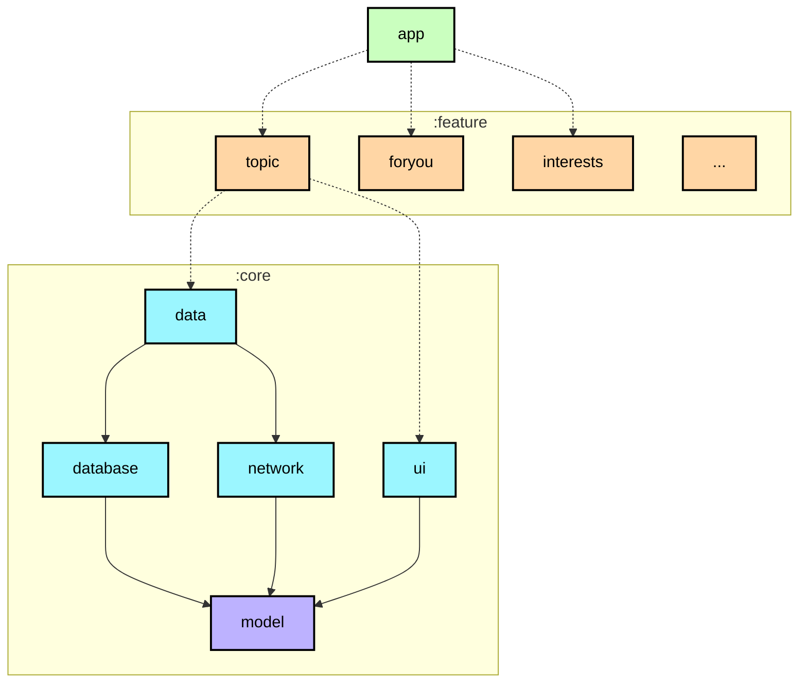
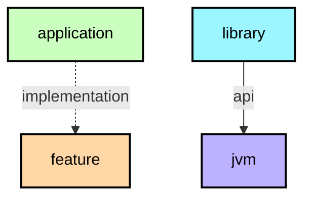

# 模块化学习之旅

在这个学习之旅中，您将了解用于在 Now in Android 应用中创建模块的模块化策略。关于模块化的理论，请查看[官方指南](https://developer.android.com/topic/modularization)。

**重要提示：** 每个模块在其 README 中都有依赖图（例如 [app 模块的依赖图](https://github.com/android/nowinandroid/tree/main/app)），这对于理解项目的整体结构非常有用。

## 模块类型

📋 图表图例

**顶级提示**：模块图（见上文）在模块化规划期间可用于可视化模块之间的依赖关系。

Now in Android 应用包含以下类型的模块：

### `app` 模块
包含应用级和脚手架类，用于绑定其余代码库，例如 `MainActivity`、`NiaApp` 和应用级控制的导航。一个很好的例子是通过 `NiaNavHost` 的导航设置和通过 `TopLevelDestination` 的底部导航栏设置。`app` 模块依赖所有 `feature` 模块和所需的 `core` 模块。

### 功能模块
这些是处理应用中单一职责的特定功能模块。例如，`ForYou` 功能处理"为你推荐"屏幕的所有内容和 UI 状态。功能模块本身不是 Gradle 模块，它们被拆分为两个子模块：

* `api` - 包含导航键
* `impl` - 包含其他所有内容

这种方法允许功能通过使用目标功能的导航键来导航到其他功能。功能的 `api` 和 `impl` 模块可供任何应用使用，包括测试或其他风味的应用。如果一个类只需要一个功能模块使用，它应该保留在该模块内。否则，应将其放入适当的 `core` 模块。

功能的 `api` 模块不应依赖另一个功能的 `api` 或 `impl` 模块。功能的 `impl` 应该只依赖另一个功能的 `api` 模块。两个子模块只能依赖它们所需的 `core` 模块。

### Core 模块
这些是包含辅助代码和需要在应用其他模块之间共享的特定依赖项的通用库模块。这些模块可以依赖其他 core 模块，但它们不应该依赖功能或 app 模块。

### 其他模块
例如，`sync`、`benchmark` 和 `test` 模块，以及 `app-nia-catalog` —— 一个用于快速展示我们设计系统的目录应用。

## 示例

<table>
  <tr>
   <td><strong>名称</strong>
   </td>
   <td><strong>职责</strong>
   </td>
   <td><strong>关键类和良好示例</strong>
   </td>
  </tr>
  <tr>
   <td><code>app</code>
   </td>
   <td>将应用正常运行所需的所有内容整合在一起。包括 UI 脚手架和导航。
   </td>
   <td><code>NiaApp, MainActivity</code> 
   通过 <code>NiaNavHost, NiaAppState, TopLevelDestination</code> 进行应用级控制的导航
   </td>
  </tr>
  <tr>
   <td><code>feature:1:api,</code> 
   <code>feature:2:api</code> 
   ...
   </td>
   <td>其他功能可用于导航到此功能的导航键和函数。  
   例如：<code>:topic:api</code> 模块暴露了一个 <code>Navigator.navigateToTopic</code> 函数，<code>:interests:impl</code> 模块使用它从 <code>InterestsScreen</code> 导航到 <code>TopicScreen</code>（当点击主题时）。
   </td>
   <td><code>TopicNavKey</code>
   </td>
  </tr>
  <tr>
   <td><code>feature:1:impl,</code> 
   <code>feature:2:impl</code> 
   ...
   </td>
   <td>与特定功能或用户旅程相关的功能。通常包含 UI 组件和从其他模块读取数据的 ViewModel。 
   示例包括： 
   <ul>
      <li><a href="https://github.com/android/nowinandroid/tree/main/feature/topic/impl"><code>feature:topic:impl</code></a> 在 TopicScreen 上显示主题信息。</li>
      <li><a href="https://github.com/android/nowinandroid/tree/main/feature/foryou/impl"><code>feature:foryou:impl</code></a> 在 For You 屏幕上显示用户的新闻订阅源和首次运行时的引导。</li>
      </ul>
   </td>
   <td><code>TopicScreen</code> 
   <code>TopicViewModel</code>
   </td>
  </tr>
  <tr>
   <td><code>core:data</code>
   </td>
   <td>从多个来源获取应用数据，由不同功能共享。
   </td>
   <td><code>TopicsRepository</code> 
   </td>
  </tr>
  <tr>
   <td><code>core:designsystem</code>
   </td>
   <td>设计系统，包括核心 UI 组件（其中许多是定制的 Material 3 组件）、应用主题和图标。可以通过运行 <code>app-nia-catalog</code> 运行配置来查看设计系统。
   </td>
   <td>
   <code>NiaIcons</code>    <code>NiaButton</code>    <code>NiaTheme</code>
   </td>
  </tr>
  <tr>
   <td><code>core:ui</code>
   </td>
   <td>功能模块使用的复合 UI 组件和资源，例如新闻订阅源。与 <code>designsystem</code> 模块不同，它依赖于数据层，因为它渲染模型，如新闻资源。
   </td>
   <td> <code>NewsFeed</code> <code>NewsResourceCardExpanded</code>
   </td>
  </tr>
  <tr>
   <td><code>core:common</code>
   </td>
   <td>模块之间共享的通用类。
   </td>
   <td><code>NiaDispatchers</code> 
   <code>Result</code>
   </td>
  </tr>
  <tr>
   <td><code>core:network</code>
   </td>
   <td>发起网络请求并处理来自远程数据源的响应。
   </td>
   <td><code>RetrofitNiaNetworkApi</code>
   </td>
  </tr>
  <tr>
   <td><code>core:testing</code>
   </td>
   <td>测试依赖项、仓库和工具类。
   </td>
   <td><code>NiaTestRunner</code> 
   <code>TestDispatcherRule</code>
   </td>
  </tr>
  <tr>
   <td><code>core:datastore</code>
   </td>
   <td>使用 DataStore 存储持久化数据。
   </td>
   <td><code>NiaPreferences</code> 
   <code>UserPreferencesSerializer</code>
   </td>
  </tr>
  <tr>
   <td><code>core:database</code>
   </td>
   <td>使用 Room 进行本地数据库存储。
   </td>
   <td><code>NiaDatabase</code> 
   <code>DatabaseMigrations</code> 
   <code>Dao</code> 类
   </td>
  </tr>
  <tr>
   <td><code>core:model</code>
   </td>
   <td>整个应用使用的模型类。
   </td>
   <td><code>Topic</code> 
   <code>Episode</code> 
   <code>NewsResource</code>
   </td>
  </tr>
</table>

## 依赖图
每个模块都有自己的 `README.md` 文件，包含模块依赖图（例如 [`:app` 模块依赖图](../app/README.md#module-dependency-graph)）。
当模块依赖发生变化时，模块依赖图会由 [Build.yaml](../.github/workflows/Build.yaml) 工作流自动更新。
您也可以通过运行 `graphUpdate` 任务手动更新依赖图。

## 进一步考虑

我们的模块化方法是考虑到"Now in Android"项目路线图、即将开展的工作和新功能而制定的。此外，我们这一次的目的是在过度模块化一个相对较小的应用与利用此机会展示适合更大代码库的模块化模式（更接近生产环境中的真实应用）之间找到适当的平衡。

这种方法曾与 Android 社区讨论过，并采纳他们的反馈而不断演进。然而，在模块化方面，没有一种正确的答案会让其他答案都错误。最终，模块化应用有很多方法和途径，很少有一种方法适合所有目的、代码库和团队偏好。这就是为什么事先计划并考虑所有目标、您要解决的问题、未来工作以及预测潜在的绊脚石，对于在您自己独特的环境下定义最合适的结构都至关重要。开发者可以受益于头脑风暴会议，绘制模块和依赖关系图，以便更好地可视化和规划。

我们的方法就是这样一个例子 —— 我们不期望它是一个适用于所有情况的不变结构，实际上，它可能在未来会演变和改变。这是一个我们发现最适合项目的总体指南，并将其作为您可以进一步修改、扩展和构建的一个示例。做到这一点的一种方法是进一步增加代码库的粒度。粒度是指您的代码库由模块组成的程度。如果您的数据层很小，将其保存在单个模块中是可以的。但一旦存储库和数据源的数量开始增长，可能值得考虑将它们拆分为单独的模块。

我们始终欢迎您的建设性反馈 —— 向社区学习并交流想法是改进我们指导的关键要素之一。
